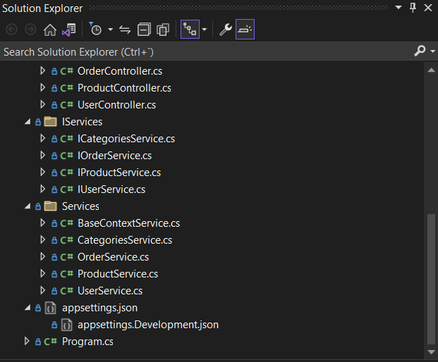
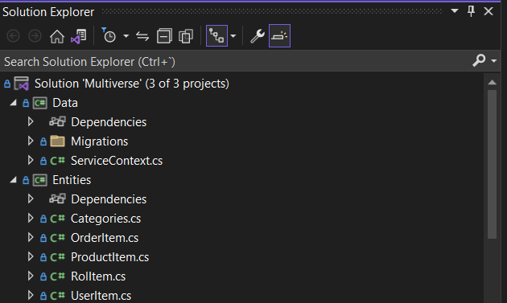
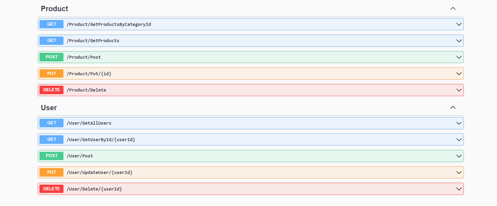
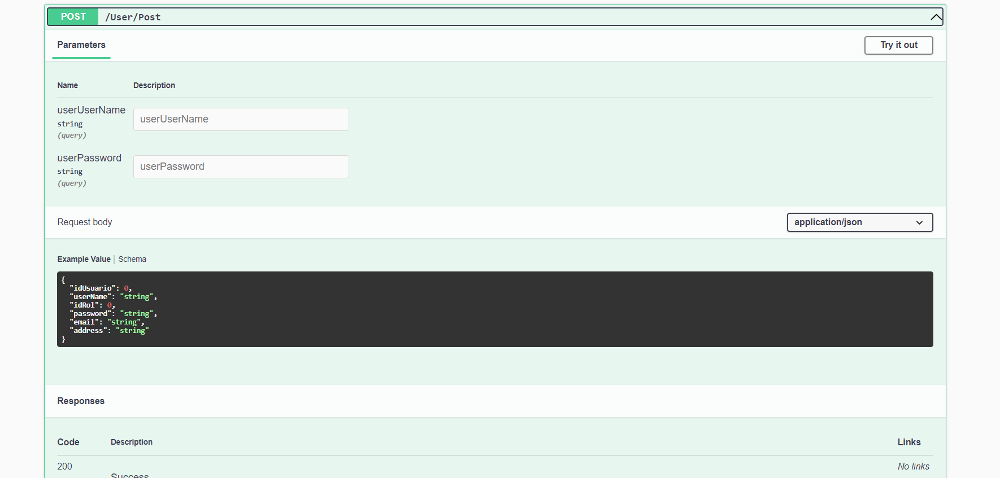
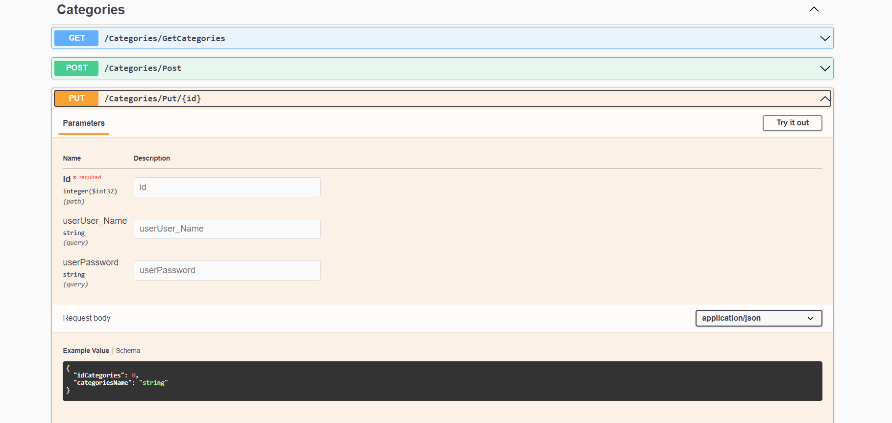

  

## Project Description 🚀

"Multiverse-Back-End" is the continuation of the project "Multiverse-Project" (https://github.com/miguelcidoncha/Multiverse-Project). As we previously described, Multiverse is an e-commerce website designed to effectively sell merchandise products and provide customers with a satisfying shopping experience. In this repository, we have worked on the Back-end content related to the database. We have built an application to store all the data for our merchandise products, categorizing them and also storing customer information. Additionally, in this application, we will also store all the order information.

## Screenshots 📷

## Stacks 🖥️
● Microsoft Visual Studio 2022  
● SQL Server  
● C#  
● Swagger  
● GitHub  
● Trello  
● Slack  
● Zoom

## Technologies and Tools 🔨

  
  
  
  
  
   

## Methodology 📚

● Mob, pair and solo programming  
● Agile with Scrum & Trello  
● Testing  
● We work with branches: 4 working branches were used on GitHub to manage the workflow:  
- Main: This branch contains functional and stable code. It is the main and/or final branch.  
- Dev: It's the branch where different working codes are integrated into one and where preliminary testing is done before production. It's an intermediate and/or safety branch.  
- Independents: These are different branches where each team member develops their code according to assigned tasks for later merging into the Dev branch. It's an independent and/or testing branch.  
+ The branch methodology allows us to work collaboratively and maintain an organized and efficient workflow. Furthermore, working in branches allows us to work freely without conflicting with the work of other team members. Additionally, it provides us with greater control and a record or history of the various changes being made. On the other hand, for added security when merging codes from different branches, we have implemented security rules on GitHub where it is necessary to create a pull request prior to the merge.

## Installation Process ⬆️
1. Clone the GitHub repository: https://github.com/miguelcidoncha/Multiverse-Back-end.
2. Open the file using Microsoft Visual Studio 2022.
3. Open View/Server Explorer and add the connection to your computer using SQL Server.
4. In appsettings.json, add your SQL Server connection under "ServiceContext". Obtain information from properties.
5. Compile the code from Microsoft Visual Studio 2022.
6. Once installed, in Swagger, to add content, you need to enter the Administrator 1 query: (Coming soon).
7. Create, modify, and delete content in Swagger.
8. View the stored data in the SQL Server tables.
9. 
## File Structure 📁
**1. API or Database:**
An API is a set of rules and protocols that allows different software applications to communicate and interact with each other. It enables developers to access certain features or data from a remote service or application. On the other hand, a database is an organized system for storing and managing data in a structured way, facilitating data retrieval and modification.

**2. Data: Table creation and data storage location using migrations:**
When developing an application that utilizes a database, it is necessary to define how the data will be structured within that database. In a relational database, data is organized into tables, where each table represents an entity or type of information. For example, a user management application might have a table to store user information and another table to store role information.

The creation of tables and the definition of their structure are done through migrations. Migrations are scripts that describe changes to the database, such as creating or modifying tables, and are executed to apply those changes to the database. This way, a record is kept of how the database structure has evolved over time.

**3. Entities: Types of tables where data will be inserted:**
In the context of databases, an entity is an abstraction that represents an object or a real-world thing, and each entity generally corresponds to a table in the database. Each row in the table represents a particular instance of that entity.

For example, in a product management application, you could have an entity called "Product" that represents the different available products. Each row in the "Product" table would be an individual instance of a product with its specific attributes, such as the product name, price, description, etc.

**4. Multiverse: The body of the application where different functionalities, interfaces, and services will be found that the application will provide:**
WebApplication1 refers to the main body of the web application. It includes the code that implements various functionalities, user interfaces, and services that the application will offer to its users. This is the part where the logic of the application resides, and it interacts with the API or database to perform specific tasks and provide the intended features to the users.

  **4.1. Controller: Functions that we are going to give to the different layers of the API:**
Controllers are functions or components that handle incoming requests, process them, and return appropriate responses. They act as an intermediary between the user interface and the backend services. In the context of an API, controllers receive requests from clients, invoke the corresponding services or business logic, and return the results back to the clients.

   **4.2. IServices: Various interfaces of the tables.**
IServices refers to the interfaces that define the contracts or blueprints for the services related to the tables/entities. These interfaces typically declare the methods that the services should implement to handle CRUD operations (Create, Read, Update, Delete) and other relevant actions related to the data in the tables.

   **4.3. Services: Where different services of the tables are stored:**
Services represent the implementation of the business logic and operations related to the entities/tables. These services implement the methods defined in the IServices interfaces. They are responsible for interacting with the database (through repositories or data access layers) and performing various operations on the data, such as reading, writing, updating, or deleting records.

**5. appsettings.json: Where SQL Server is linked to the database.**
appsettings.json is a configuration file in which various settings for the application are stored. In the context of linking SQL Server to the database, this file may contain connection strings that specify the necessary information to connect to the SQL Server instance, such as the server name, database name, authentication details, etc.

**6. Program: The place of connection between the API and Swagger.**
The "Program" refers to the entry point of the application. In the context of an API, this is where the application is configured and started. Swagger is a tool that provides documentation and testing capabilities for APIs. In the "Program" file, the API may be configured to integrate with Swagger, allowing developers and users to easily explore and interact with the API's endpoints.

## Next Steps 🔜

In the future, we intend to merge the Front-end (https://github.com/miguelcidoncha/Multiverse-Project) with this Back-end repository. The goal is to transform Multiverse into a FullStack website. Additionally, we want to continue enhancing our database by storing a greater variety of products and categories, making our e-commerce site more attractive, not only visually as we have previously mentioned in the other repository but also by providing a more comprehensive product search. Likewise, we will continue working on maintaining our FullStack website to make it increasingly stable and dynamic, allowing us to maximize performance both for us as administrators and for our customers.

## Authors 👨‍💻👩‍💻

| [ Laura Barrero](https://github.com/laurabarrerogonzalez) | [ Rebeca Poma](https://github.com/rebecapoma6) | [ Javier Serrano](https://github.com/JaviSeC) | [ Miguel Cidoncha](https://github.com/miguelcidoncha) |
| :---: | :---: | :---: | :---: |

